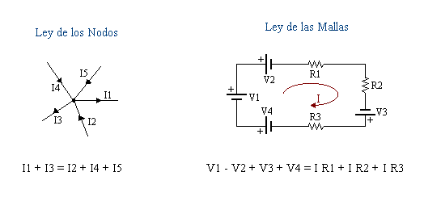

# PRACTICA-No.-1-LEYES-DE-KIRCHHOFF
# Informe 

1. OBJETIVOS 

1.1. OBJETIVO GENERAL

- Adaptar un  diagrama electrico a un prototipo virtual mediante el uso de Tinkercad para comprender de mejor manera como se aplican las leyes de Kirchhoff en un circuito electrico.

 1.2. OBJETIVO ESPECIFICO

- Calcular la intensidad de corriente y el voltaje que atraviesa por el circuito mediante las leyes de Kirchhoff.
- Diferenciar los resultados obtenidos analiticamente y mediante el simulador Tinkercad para poder detenerminar cual es el porsentaje de error.
- Aclarar la utilizacin del multimetro al momento de medir la corriente y el voltaje en un circuito.

2. MARCO TEORICO

3. DIAGRAMAS

Lo que haremos es pasar del diagrama electrico a al protoboard de forma firtual.

4. LISTA DE COMPONENTES

| CANTIDAD|MATERIAL O EQUIPO|
| ----- | ---- |
| 1|Fuente de Voltaje de C.D.|
|2|Multimetros digitales|
|1|Resistor de 1 kΩ|
|2|Resistores de 2.2 kΩ|
|1|Resistor de 1.8 kΩ|
|1|Resistor de 3.9 kΩ|
|1|Protoboard|

Tambien se utilizo tinkercad que nos sirvio como laboratorio virtual.

5. EXPLICACION 

Estamos ante un circuito resistivo mixto en el que se encuentran conectadas 5 resistencias en 2 diferentes configuraciones, en serie y en paralelo, en dicho circuito se puede calcular la intensidad y el voltaje utilizando las 2 leyes de Kirchhoff, se lo puede analizar al circuito de forma general para calcular el Vt y la It pero también se lo puede hacer de forma individual para calcular el V y la I en un punto exacto del circuito. Para el voltaje de debe analizar cada malla que haya en el circuito, aquí se encuentran las resistencias que fueron conectadas en serie y para la intensidad se debe analizar cada nodo que se forme en el circuito donde se encuentran las resistencias conectadas en paralelo. Este análisis es muy detallado y nos permite evidenciar el comportamiento del voltaje y la intensidad cuando se conecta un circuito mixto.

Tabla 1.1. Resultados obtenidos de voltaje y corriente 

Tabla 1.2. verificacion de la LVK

Con los resultados obtenidos queda demostrada la veracidad del la LVK , debido a que se lo realizo en un simulador on-line el margen de error es minimo 

6. CONCLUCION 

- Gracias a la aplicacon de tinkercad se pudo pasar de un modelo esquematico a uno un poco mas real donde se logro observar cual es la manera correcta de conectar un circuito mixto y a su vez nos permitio comprobar el funcionamiento de las leyes de Kirchhoff de una manera mas real.
- El multimetro fue una herramienta de gran utilidad al momento de medir la intensidad y el voltaje que pasa por el circuito , tomando en cuenta que para medir las resistencias se debe realizar en serie.
- Al ser tinkercad una plataforma on-line es poco probable tener un margen de error si tomamos en cuenta los valores medidos y los calculados, podria haber un porsentaje de error pero seria minimo, esta variacion en los calculos se los puede evidenciar de mejor manera cuando se arme el circuito de forma fisica.

7. BIBLIOGRAFIA

Las leyes de Kirchhoff. (2019). Khan Academy. https://es.khanacademy.org/science/physics/circuits-topic/circuits-resistance/a/ee-kirchhoffs-laws#:~:text=Ley%20de%20voltaje%20de%20Kirchhoff,malla%20es%20igual%20a%20cero.&text=donde%20n%20es%20el%20n%C3%BAmero,los%20componentes%20en%20la%20malla.&text=Si%20caminas%20alrededor%20de%20la,malla%20es%20igual%20a%20cero.

R. (2019, 27 mayo). ▷ ¿Cuáles son las Leyes de Kirchhoff? Centro Estudios Cervantinos. https://www.centroestudioscervantinos.es/leyes-de-kirchhoff/
