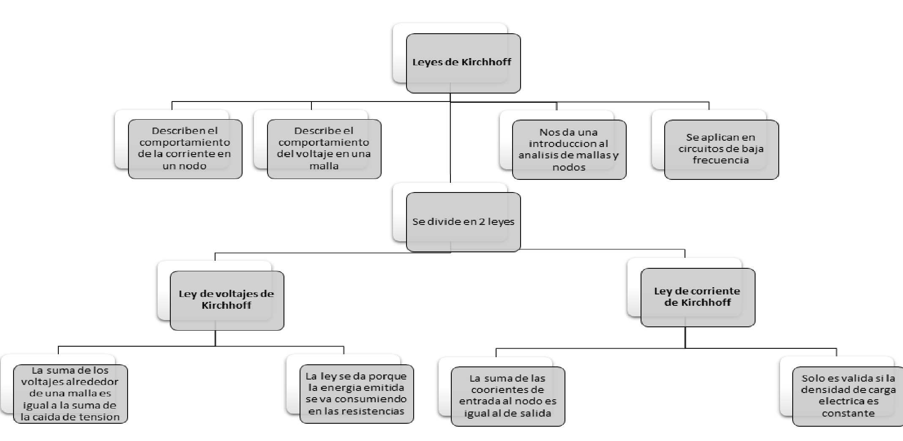

# PRACTICA-No.-1-LEYES-DE-KIRCHHOFF
# Informe 

1. OBJETIVOS 

1.1. OBJETIVO GENERAL

- Adaptar un  diagrama electrico a un prototipo virtual mediante el uso de Tinkercad para comprender de mejor manera como se aplican las leyes de Kirchhoff en un circuito electrico.

 1.2. OBJETIVO ESPECIFICO

- Calcular la intensidad de corriente y el voltaje que atraviesa por el circuito mediante las leyes de Kirchhoff.
- Diferenciar los resultados obtenidos analiticamente y mediante el simulador Tinkercad para poder detenerminar cual es el porsentaje de error.
- Aclarar la utilizacin del multimetro al momento de medir la corriente y el voltaje en un circuito.

2. MARCO TEORICO

3. DIAGRAMAS

4. LISTA DE COMPONENTES

5. EXPLICACION 

6. MANUAL DE USUARIO

7. DESCRIPCION DE PRERREQUISITOS Y CONFIGURACIONES

8. CONCLUCION 

9. BIBLIOGRAFIA

